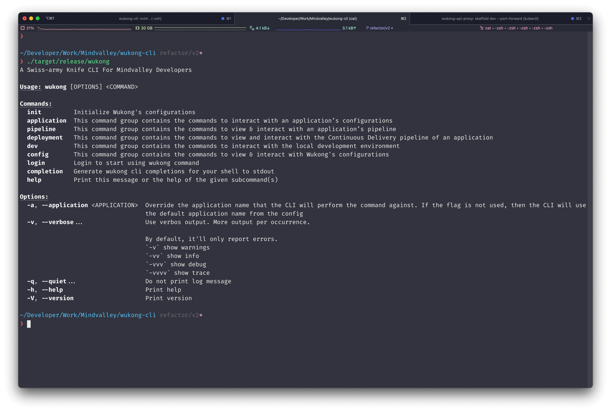

<div align="center">
  
</div>

<p align="center">
  <h1 align="center">
    Wukong CLI
  </h1>
</p>

<p align="center">A Swiss-army Knife CLI For Mindvalley Developers</p>

<div align="center">
    <a href="https://github.com/mindvalley/wukong-cli/actions/workflows/ci.yml">
      
    </a>
    <a href="https://github.com/mindvalley/wukong-cli/actions/workflows/release.yml">
      
    </a>
</div>

<div align="center">
  
</div>

## THE IDEA

The Wukong CLI is a set of tools to manage Mindvalley DevOps resources. Its goal is to provide a one-stop shop for developers to interact with the Mindvalley DevOps ecosystem. By centralizing different tasks on different tools into a single CLI, It will solve these problems when it comes to adopting DevOps practices:

- Knowledge Gaps: Learning to use a new tool can be painful. Each tool has a unique UI & UX, as well as different workflows.
- Getting Lost in the ecosystem: It’s completely normal for a company to have 20+ different DevOps tools, so knowing which tool to use and remember where to access it can be a problem. After all developers are having enough trouble dealing with their day to day tasks.

> **Note**
> You can read more from [here](https://mindvalley.atlassian.net/wiki/spaces/PXP/pages/450396161/PD2+-+A+Swiss-army+Knife+CLI+For+Mindvalley+Developers)

## BREAKING CHANGES !!!!

In the latest version of Wukong CLI, we've made a significant change to how the CLI operates. Now, the CLI requires to be run inside a working folder that contains the `.wukong.toml` configuration file.

To use the CLI, navigate to your project's root directory (or any directory containing the `.wukong.toml` file) in your terminal. Then, you can run the Wukong CLI commands as usual.

For example:

```sh
cd /path/to/your/project
wukong command
```

Read more about the reasons behind this breaking change [here](guides/upgrade_from_2.0.x_to_2.1.0.md).

## INSTALLATION

For installation on various platforms, you can follow the detailed instructions provided in the [Installation](https://github.com/mindvalley/wukong-cli/wiki/Installation) page. For a quick installation using Homebrew, run the following command:

```bash
brew tap mindvalley/wukong
brew update
brew install wukong
```

Additionally, you can enable completions on popular shell like bash/zsh by following [this guide](https://docs.brew.sh/Shell-Completion).

## GUIDES

- [How to use the Vault integration with Elixir projects](guides/elixir_working_with_secrets_in_bunker.md).
- [How to use the Vault integration with arbitrary secrets](guides/working_with_generic_secrets_in_bunker.md).

## Get Started for Development

Make sure you have [Rust](https://www.rust-lang.org/) installed. The recommended way is to install [Rustup](https://www.rust-lang.org/learn/get-started), the Rust installer and version management tool, using:

```bash
curl --proto '=https' --tlsv1.2 -sSf https://sh.rustup.rs | sh
```

Then you should be able to check your rust version using:

```bash
rustc --version
# output
# rustc 1.63.0 (4b91a6ea7 2022-08-08)
```

> **Note** > `rustc` is the Rust compiler

Since this CLI is a binary program, you can start the program using:

```bash
# compile and run the cli program
cargo run

# compile and run the cli program with help flag
cargo run -- --help
```

To build the cli program, use:

```bash
# using --release flag will trigger the release build, optimized and no debug info
cargo build --release

# run the cli
./target/release/wukong --help
```

> **Note** > `cargo` is the Rust build tool and package manager

## Recommendation

Use [rust-analyzer](https://rust-analyzer.github.io/), a new implementation of the Language Server Protocol (LSP) for Rust.
It is now [officially a part of the wider Rust organization](https://blog.rust-lang.org/2022/02/21/rust-analyzer-joins-rust-org.html).

## Safety

This program uses `#![forbid(unsafe_code)]` to ensure everything is implemented in **100% Safe Rust**.

## License

Licensed under MIT license ([LICENSE](LICENSE) or http://opensource.org/licenses/MIT)
