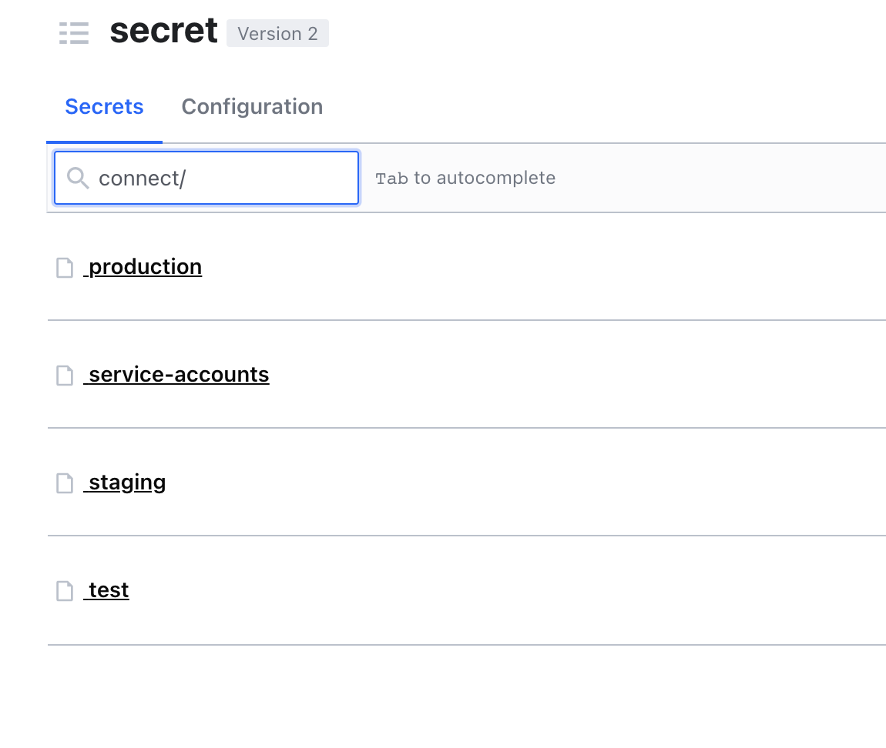
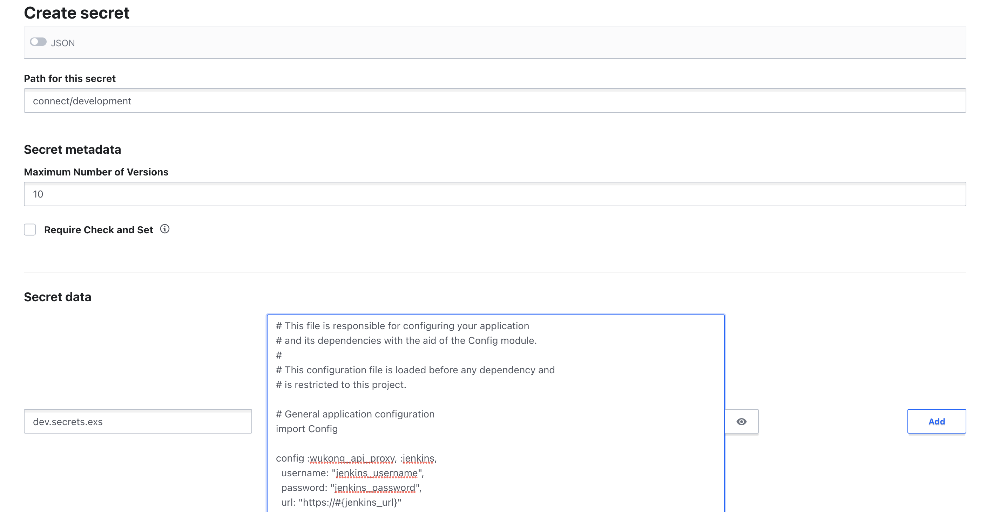

# HOW TO INTEGRATE WITH SECRETS IN BUNKER FOR ELIXIR PROJECT

In this article, we will go through the neccessary steps to integrate with Bunker for Elixir project using the Wukong CLI. After following this guide, you will be able to pull the secrets from Bunker, under the form of an Elixir config, as well as publishing new changes for the secrets, to let Bunker become the single source of truth for your development environment configuration.  

## Preparing the secrets file in Bunker.  

First, you will need to prepare the Elixir config secrets in Bunker. This is actually an Elixir config, containing the config values that are not allowed to be stored in the Git repo, for example API Keys, Credentials, etc....

You can choose whatever secret path for your secrets file in Bunker, as long as you have the write permission for it, and your teammates also have the same permission. The general rule of thumb here is creating the secret under an existing secret path of your application. For example

* The application you want to integrate is `mv-connect`.  
* In Bunker, there's already a secret path named `connect`. Like this 



* Then, create the secret the development path. And add the contents of the Elixir secrets config into the `Secret Data` section below. For convenient, you can choose the name to match with the config file will be presented in your local machine later. Let's say you name the file `dev.secrets.exs`, it will be like this.



* Finally, press `Save` to save the secrets file into Bunker.  

**IMPORTANT**

It's important to know that you may not have permission to create the secret in Bunker, since the permission is depends on your Okta group. If you encouter the `Permission Error` message when creating secrets, kindly contact SRE team by the following method.  

* (Recommended) Raise a Jira ticket at https://mindvalley.atlassian.net/servicedesk/customer/portal/3/group/15.  
* Posting into Slack channel #tech-general.  

## Add the annotation into your Elixir config.  

To allow the Wukong CLI to be able to detect and pull the secrets file for you, you need to add an annotation into your development configuration file. For Elixir project, normally it will be the `dev.exs` file. 

The code snippet (example) will be like this.  
```elixir
# wukong.mindvalley.dev/config-secrets-location: vault:secret/wukong-api-proxy/development#dev.secrets.exs
if File.exists?("config/dev.secrets.exs") do
  import_config("dev.secrets.exs")
end
```

**EXPLANATION**

The first line.
```
# wukong.mindvalley.dev/config-secrets-location: vault:secret/wukong-api-proxy/development#dev.secrets.exs
```
is an annotation. It will tell the Wukong CLI where to look for the secrets in the Bunker. You will need to supply the value to match with the secret path in Bunker. In the previous example, we created a secrets file under the `connect/development` path, with the key named `#dev.secrets.exs`, so the final annotation will be like this.  
```
# wukong.mindvalley.dev/config-secrets-location: vault:secret/connect/development#dev.secrets.exs
```

Next is this snippet.
```elixir
if File.exists?("config/dev.secrets.exs") do
  import_config("dev.secrets.exs")
end
```
The conditional expression is to allow the Elixir project able to compiles, even when you did you pull the secrets. If you don't put the conditional check and forgot to pull the secrets (for example on first checkout), the compilation will fail. 

So the final snippet will be like this.  
```elixir
# wukong.mindvalley.dev/config-secrets-location: vault:secret/connect/development#dev.secrets.exs
if File.exists?("config/dev.secrets.exs") do
  import_config("dev.secrets.exs")
end
```

## Pulling the secrets.  

At the top-level of the Elixir project, run this command.  

`wukong dev config pull`

You will be asked to login to Bunker using your Okta credentials, and performing the 2FA verification using Okta Verify mobile app. If things go well, you will see something like this.  

```bash
wukong dev config pull

🔍 1 annotation(s) found in /Users/tuanco/code-workspaces/elixir/src/github.com/mindvalley/connect/config/dev.exs
        Created /Users/tuanco/code-workspaces/elixir/src/github.com/mindvalley/connect/config/dev.secrets.exs
```

**NOTES**

If you see some errors at this step, for example `Secret Not Found`, it maybe of the following reasons:  
* You did not create the secrets file in Bunker yet.  
* You did not have proper permission to access the secrets file in Bunker.  

In this case, make sure you are able to see the secrets in the Bunker by visiting https://bunker.mindvalley.dev:8200. If the problem persists, do let us know by sending us a message to Slack channel #wukong-dev-team.  

## Pusing the secrets.  

If you have the permission to edit the secrets in Bunker, you can also make changes to the secrets locally, then push it to Bunker using this command.  
`wukong dev config push`  

This command will compare your local version vs the remote version in Bunker, and shows you the diff, similar like a `git diff`.  You then can choose whether you want to push the changes to Bunker or not.  
