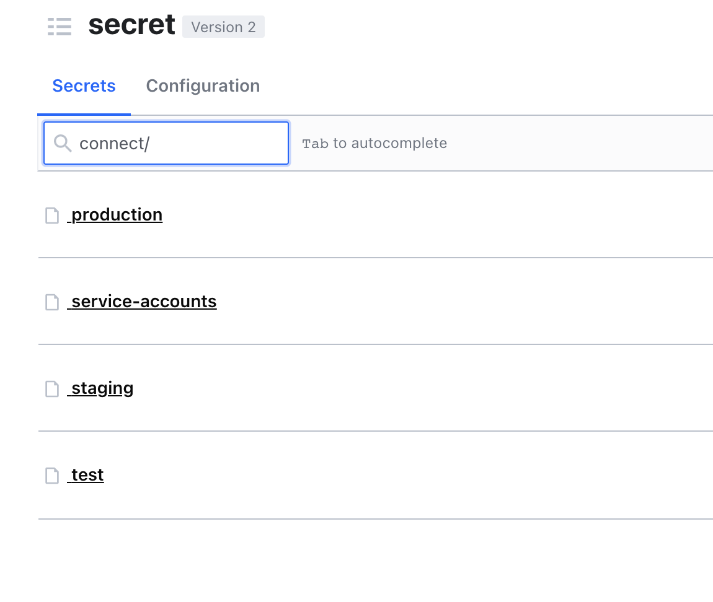

# HOW TO INTEGRATE WITH SECRETS IN BUNKER FOR ANY ARBITRARY SECRETS

In this article, we will go through the neccessary steps to integrate with Bunker any project using the Wukong CLI. After following this guide, you will be able to pull the secrets from Bunker, as well as publishing new changes for the secrets, to let Bunker become the single source of truth for your development environment configuration.  

## Preparing the secrets file in Bunker.  

First, you will need to prepare the secrets in Bunker. This can be any type of secrets, for example API Keys, SSH Credentials, Database Credentials etc....

You can choose whatever secret path for your secrets file in Bunker, as long as you have the write permission for it, and your teammates also have the same permission. The general rule of thumb here is creating the secret under an existing secret path of your application. For example

* The application you want to integrate is `mv-connect`.  
* In Bunker, there's already a secret path named `connect`. Like this 



* Then, create the secret the development path.  

* Finally, press `Save` to save the secrets file into Bunker.  

**IMPORTANT**

It's important to know that you may not have permission to create the secret in Bunker, since the permission is depends on your Okta group. If you encouter the `Permission Error` message when creating secrets, kindly contact SRE team by the following method.  

* (Recommended) Raise a Jira ticket at https://mindvalley.atlassian.net/servicedesk/customer/portal/3/group/15.  
* Posting into Slack channel #tech-general.  

## Create the .wukong.toml    

To allow the Wukong CLI to be able to detect and pull the secrets file for you, you need to put a `.wukong.toml` config file in the top-level of your working folder. 
You can find an example of the file in the [example](guides/examples) folder. Let's assume you want to pull a secret from Bunker to the `.env` file on your working directory.

```toml
[[secrets]]

[secrets.dotenv]
provider = "bunker"
kind = "generic"
src = "vault:secret/mv/tech/app/dev#dotenv"
dst = ".env"
```

**EXPLANATION**

The first line.
```
provider = "bunker"
```
This to tell the Wukong CLI that which secrets provider you are using. At this moment, it only accepts the `bunker` as value. Any other values will be ignored.    
```
kind = "generic"
```
This to tell the Wukong CLI what kind of secret you are pulling. At this moment it only accepts the `generic` as value. Any other values will be ignored.  
```
src = "vault:secret/mv/tech/app/dev#dotenv"
```
This is the path to the secret in Bunker. The part after the `#` indicates which key you are pulling from the secret.
```
dst = ".env"
```
This is the path to write the secret to your working folder. The path MUST be a relative path, you're not allowed to write to any path outside of your working folder.
If the path containing sub-folder, Wukong CLI will automatically creates the sub-folder for you.

## Pulling the secrets.  

At the top-level of the project, run this command.  

`wukong dev config pull`

You will be asked to login to Bunker using your Okta credentials, and performing the 2FA verification using Okta Verify mobile app. If things go well, you will see something like this.  

```bash
wukong dev config pull

🔍 1 annotation found in /Users/tuanco/code-workspaces/elixir/src/github.com/mindvalley/wukong-ci-mock-app/.wukong.toml
        Created /Users/tuanco/code-workspaces/elixir/src/github.com/mindvalley/wukong-ci-mock-app/.env
```

**NOTES**

If you see some errors at this step, for example `Secret Not Found`, it maybe of the following reasons:  
* You did not create the secrets file in Bunker yet.  
* You did not have proper permission to access the secrets file in Bunker.  

In this case, make sure you are able to see the secrets in the Bunker by visiting https://bunker.mindvalley.dev:8200. If the problem persists, do let us know by sending us a message to Slack channel #wukong-dev-team.  

## Pusing the secrets.  

If you have the permission to edit the secrets in Bunker, you can also make changes to the secrets locally, then push it to Bunker using this command.  
`wukong dev config push`  

This command will compare your local version vs the remote version in Bunker, and shows you the diff, similar like a `git diff`.  You then can choose whether you want to push the changes to Bunker or not.  
